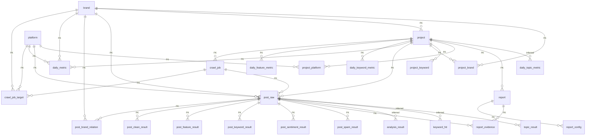

# ProdWatch SQLite 数据库结构（代码/DB自检生成）

- 数据库文件：`backend/database/database..sqlite`
- 生成时间：2026-04-11 22:43:51 +0800
- 重新生成：`python backend/database/dump_schema.py`

## 表总览

| 表名 | 用途（按代码命名推断） |
| --- | --- |
| `analysis_result` | 帖子综合分析结果（entities/features/issues JSON，按 post_id 覆盖写入） |
| `brand` | 品牌 |
| `crawl_job` | 刷新/抓取任务（一次运行） |
| `crawl_job_target` | 抓取任务目标（平台/品牌/关键词维度的拆分） |
| `daily_feature_metric` | 按天聚合的“特征/卖点”指标 |
| `daily_keyword_metric` | 按天聚合的关键词命中指标 |
| `daily_metric` | 按天聚合的核心指标（帖子数、情感、互动等） |
| `daily_topic_metric` | 按天聚合的主题指标（由 topic_result + post_raw 派生） |
| `keyword_hit` | 帖子内关键词命中明细（matched_text） |
| `llm_call_log` | LLM 调用日志（调试/缓存/审计） |
| `llm_task_config` | LLM 任务配置（provider/model/fallback） |
| `llm_task_schema_log` | LLM 任务 schema 记录（按 crawl_job_id + task_type 维度） |
| `platform` | 平台（数据源） |
| `post_brand_relation` | 帖子与品牌的关联（可支持一帖多品牌） |
| `post_clean_result` | 帖子清洗/有效性判定结果 |
| `post_feature_result` | 帖子“特征/卖点”抽取结果（多行） |
| `post_keyword_result` | 帖子关键词抽取结果（多行） |
| `post_raw` | 原始帖子/舆情数据（核心事实表） |
| `post_sentiment_result` | 帖子情感分析结果 |
| `post_spam_result` | 帖子垃圾/水军识别结果 |
| `project` | 监控项目（配置与状态） |
| `project_brand` | 项目-品牌 关联 |
| `project_keyword` | 项目关键词配置 |
| `project_platform` | 项目-平台 关联 |
| `report` | 报告（生成结果，含 markdown） |
| `report_config` | 报告生成配置快照 |
| `report_evidence` | 报告证据（引用哪些帖子支撑某段结论） |
| `topic_result` | 帖子主题识别结果（多行，source 区分来源） |

## 关系图（ER，基于外键 + 少量推断）

说明：部分表由代码按需 `CREATE TABLE IF NOT EXISTS` 创建，未声明外键（例如 `analysis_result/keyword_hit/topic_result/daily_topic_metric`），下面会在图中以“推断关系”补上。

## 关键约束与索引

### UNIQUE/去重键（含自动索引）

| 表 | UNIQUE/PK 索引 | 列 |
| --- | --- | --- |
| `brand` | `sqlite_autoindex_brand_1` | `name` |
| `daily_metric` | `sqlite_autoindex_daily_metric_1` | `project_id`, `brand_id`, `platform_id`, `stat_date` |
| `daily_topic_metric` | `sqlite_autoindex_daily_topic_metric_1` | `project_id`, `brand_id`, `platform_id`, `stat_date`, `topic` |
| `keyword_hit` | `sqlite_autoindex_keyword_hit_1` | `post_id`, `keyword` |
| `llm_task_config` | `sqlite_autoindex_llm_task_config_1` | `task_type` |
| `llm_task_schema_log` | `sqlite_autoindex_llm_task_schema_log_1` | `crawl_job_id`, `task_type` |
| `platform` | `sqlite_autoindex_platform_1` | `code` |
| `post_raw` | `sqlite_autoindex_post_raw_1` | `project_id`, `platform_id`, `dedup_key` |
| `project` | `sqlite_autoindex_project_1` | `name` |
| `project_brand` | `sqlite_autoindex_project_brand_1` | `project_id`, `brand_id` |
| `project_platform` | `sqlite_autoindex_project_platform_1` | `project_id`, `platform_id` |
| `topic_result` | `sqlite_autoindex_topic_result_1` | `post_id`, `topic`, `source` |

### 非唯一索引

| 表 | 索引 | 列 |
| --- | --- | --- |
| `daily_metric` | `idx_daily_metric` | `project_id`, `stat_date` |
| `daily_topic_metric` | `idx_daily_topic_metric_proj_date` | `project_id`, `stat_date` |
| `daily_topic_metric` | `idx_daily_topic_metric_topic` | `topic` |
| `keyword_hit` | `idx_keyword_hit_post` | `post_id` |
| `llm_call_log` | `idx_llm_call_log_task_time` | `task_type`, `created_at` |
| `post_raw` | `idx_post_platform` | `platform_id` |
| `post_raw` | `idx_post_project` | `project_id` |
| `post_raw` | `idx_post_time` | `publish_time` |
| `post_sentiment_result` | `idx_sentiment_post` | `post_id` |
| `post_spam_result` | `idx_spam_post` | `post_id` |
| `topic_result` | `idx_topic_result_post` | `post_id` |
| `topic_result` | `idx_topic_result_topic` | `topic` |

## 详细表结构

### `analysis_result`

帖子综合分析结果（entities/features/issues JSON，按 post_id 覆盖写入）

| 字段 | 类型 | PK | NOT NULL | 默认值 | 外键引用 |
| --- | --- | --- | --- | --- | --- |
| `post_id` | INTEGER | Y |  |  |  |
| `entities_json` | TEXT |  |  |  |  |
| `features_json` | TEXT |  |  |  |  |
| `issues_json` | TEXT |  |  |  |  |
| `created_at` | DATETIME |  |  |  |  |
| `updated_at` | DATETIME |  |  |  |  |

### `brand`

品牌

| 字段 | 类型 | PK | NOT NULL | 默认值 | 外键引用 |
| --- | --- | --- | --- | --- | --- |
| `id` | INTEGER | Y |  |  |  |
| `name` | TEXT |  | Y |  |  |
| `alias` | TEXT |  |  |  |  |
| `category` | TEXT |  |  |  |  |
| `created_at` | DATETIME |  |  |  |  |

| 索引 | UNIQUE | 列 |
| --- | --- | --- |
| `sqlite_autoindex_brand_1` | Y | `name` |

### `crawl_job`

刷新/抓取任务（一次运行）

| 字段 | 类型 | PK | NOT NULL | 默认值 | 外键引用 |
| --- | --- | --- | --- | --- | --- |
| `id` | INTEGER | Y |  |  |  |
| `project_id` | INTEGER |  | Y |  | `project(id)` |
| `job_type` | TEXT |  |  |  |  |
| `trigger_source` | TEXT |  |  |  |  |
| `schedule_type` | TEXT |  |  |  |  |
| `schedule_expr` | TEXT |  |  |  |  |
| `status` | TEXT |  |  |  |  |
| `started_at` | DATETIME |  |  |  |  |
| `ended_at` | DATETIME |  |  |  |  |
| `created_by` | TEXT |  |  |  |  |
| `error_message` | TEXT |  |  |  |  |

| 从列 | 引用 | ON UPDATE | ON DELETE |
| --- | --- | --- | --- |
| `project_id` | `project`.`id` | NO ACTION | NO ACTION |

### `crawl_job_target`

抓取任务目标（平台/品牌/关键词维度的拆分）

| 字段 | 类型 | PK | NOT NULL | 默认值 | 外键引用 |
| --- | --- | --- | --- | --- | --- |
| `id` | INTEGER | Y |  |  |  |
| `crawl_job_id` | INTEGER |  | Y |  | `crawl_job(id)` |
| `platform_id` | INTEGER |  |  |  | `platform(id)` |
| `brand_id` | INTEGER |  |  |  | `brand(id)` |
| `keyword` | TEXT |  |  |  |  |

| 从列 | 引用 | ON UPDATE | ON DELETE |
| --- | --- | --- | --- |
| `brand_id` | `brand`.`id` | NO ACTION | NO ACTION |
| `platform_id` | `platform`.`id` | NO ACTION | NO ACTION |
| `crawl_job_id` | `crawl_job`.`id` | NO ACTION | NO ACTION |

### `daily_feature_metric`

按天聚合的“特征/卖点”指标

| 字段 | 类型 | PK | NOT NULL | 默认值 | 外键引用 |
| --- | --- | --- | --- | --- | --- |
| `id` | INTEGER | Y |  |  |  |
| `project_id` | INTEGER |  | Y |  | `project(id)` |
| `brand_id` | INTEGER |  |  |  |  |
| `stat_date` | DATE |  |  |  |  |
| `feature_name` | TEXT |  |  |  |  |
| `mention_count` | INTEGER |  |  |  |  |
| `positive_count` | INTEGER |  |  |  |  |
| `neutral_count` | INTEGER |  |  |  |  |
| `negative_count` | INTEGER |  |  |  |  |

| 从列 | 引用 | ON UPDATE | ON DELETE |
| --- | --- | --- | --- |
| `project_id` | `project`.`id` | NO ACTION | NO ACTION |

### `daily_keyword_metric`

按天聚合的关键词命中指标

| 字段 | 类型 | PK | NOT NULL | 默认值 | 外键引用 |
| --- | --- | --- | --- | --- | --- |
| `id` | INTEGER | Y |  |  |  |
| `project_id` | INTEGER |  | Y |  | `project(id)` |
| `brand_id` | INTEGER |  |  |  |  |
| `platform_id` | INTEGER |  |  |  |  |
| `stat_date` | DATE |  |  |  |  |
| `keyword` | TEXT |  |  |  |  |
| `hit_count` | INTEGER |  |  |  |  |
| `created_at` | DATETIME |  |  |  |  |

| 从列 | 引用 | ON UPDATE | ON DELETE |
| --- | --- | --- | --- |
| `project_id` | `project`.`id` | NO ACTION | NO ACTION |

### `daily_metric`

按天聚合的核心指标（帖子数、情感、互动等）

| 字段 | 类型 | PK | NOT NULL | 默认值 | 外键引用 |
| --- | --- | --- | --- | --- | --- |
| `id` | INTEGER | Y |  |  |  |
| `project_id` | INTEGER |  | Y |  | `project(id)` |
| `brand_id` | INTEGER |  |  |  | `brand(id)` |
| `platform_id` | INTEGER |  |  |  | `platform(id)` |
| `stat_date` | DATE |  |  |  |  |
| `total_post_count` | INTEGER |  |  |  |  |
| `valid_post_count` | INTEGER |  |  |  |  |
| `spam_post_count` | INTEGER |  |  |  |  |
| `positive_count` | INTEGER |  |  |  |  |
| `neutral_count` | INTEGER |  |  |  |  |
| `negative_count` | INTEGER |  |  |  |  |
| `avg_sentiment_score` | REAL |  |  |  |  |
| `total_like_count` | INTEGER |  |  |  |  |
| `total_comment_count` | INTEGER |  |  |  |  |
| `total_share_count` | INTEGER |  |  |  |  |
| `keyword_count` | INTEGER |  |  |  |  |
| `created_at` | DATETIME |  |  |  |  |

| 索引 | UNIQUE | 列 |
| --- | --- | --- |
| `sqlite_autoindex_daily_metric_1` | Y | `project_id`, `brand_id`, `platform_id`, `stat_date` |
| `idx_daily_metric` |  | `project_id`, `stat_date` |

| 从列 | 引用 | ON UPDATE | ON DELETE |
| --- | --- | --- | --- |
| `platform_id` | `platform`.`id` | NO ACTION | NO ACTION |
| `brand_id` | `brand`.`id` | NO ACTION | NO ACTION |
| `project_id` | `project`.`id` | NO ACTION | NO ACTION |

### `daily_topic_metric`

按天聚合的主题指标（由 topic_result + post_raw 派生）

| 字段 | 类型 | PK | NOT NULL | 默认值 | 外键引用 |
| --- | --- | --- | --- | --- | --- |
| `id` | INTEGER | Y |  |  |  |
| `project_id` | INTEGER |  | Y |  |  |
| `brand_id` | INTEGER |  |  |  |  |
| `platform_id` | INTEGER |  |  |  |  |
| `stat_date` | DATE |  | Y |  |  |
| `topic` | TEXT |  | Y |  |  |
| `hit_count` | INTEGER |  |  |  |  |
| `created_at` | DATETIME |  |  |  |  |

| 索引 | UNIQUE | 列 |
| --- | --- | --- |
| `sqlite_autoindex_daily_topic_metric_1` | Y | `project_id`, `brand_id`, `platform_id`, `stat_date`, `topic` |
| `idx_daily_topic_metric_proj_date` |  | `project_id`, `stat_date` |
| `idx_daily_topic_metric_topic` |  | `topic` |

### `keyword_hit`

帖子内关键词命中明细（matched_text）

| 字段 | 类型 | PK | NOT NULL | 默认值 | 外键引用 |
| --- | --- | --- | --- | --- | --- |
| `id` | INTEGER | Y |  |  |  |
| `post_id` | INTEGER |  | Y |  |  |
| `keyword` | TEXT |  | Y |  |  |
| `matched_text` | TEXT |  | Y |  |  |
| `created_at` | DATETIME |  |  |  |  |

| 索引 | UNIQUE | 列 |
| --- | --- | --- |
| `sqlite_autoindex_keyword_hit_1` | Y | `post_id`, `keyword` |
| `idx_keyword_hit_post` |  | `post_id` |

### `llm_call_log`

LLM 调用日志（调试/缓存/审计）

| 字段 | 类型 | PK | NOT NULL | 默认值 | 外键引用 |
| --- | --- | --- | --- | --- | --- |
| `id` | INTEGER | Y |  |  |  |
| `task_type` | TEXT |  | Y |  |  |
| `provider` | TEXT |  | Y |  |  |
| `model` | TEXT |  |  |  |  |
| `prompt_version` | TEXT |  |  |  |  |
| `ok` | INTEGER |  | Y |  |  |
| `error_message` | TEXT |  |  |  |  |
| `request_json` | TEXT |  |  |  |  |
| `response_json` | TEXT |  |  |  |  |
| `created_at` | DATETIME |  |  |  |  |

| 索引 | UNIQUE | 列 |
| --- | --- | --- |
| `idx_llm_call_log_task_time` |  | `task_type`, `created_at` |

### `llm_task_config`

LLM 任务配置（provider/model/fallback）

| 字段 | 类型 | PK | NOT NULL | 默认值 | 外键引用 |
| --- | --- | --- | --- | --- | --- |
| `task_type` | TEXT | Y |  |  |  |
| `provider` | TEXT |  | Y |  |  |
| `model` | TEXT |  |  |  |  |
| `fallback_provider` | TEXT |  | Y | 'mock' |  |
| `fallback_model` | TEXT |  |  |  |  |
| `updated_at` | DATETIME |  |  |  |  |

| 索引 | UNIQUE | 列 |
| --- | --- | --- |
| `sqlite_autoindex_llm_task_config_1` | Y | `task_type` |

### `llm_task_schema_log`

LLM 任务 schema 记录（按 crawl_job_id + task_type 维度）

| 字段 | 类型 | PK | NOT NULL | 默认值 | 外键引用 |
| --- | --- | --- | --- | --- | --- |
| `crawl_job_id` | INTEGER | Y | Y |  |  |
| `task_type` | TEXT | Y | Y |  |  |
| `provider` | TEXT |  |  |  |  |
| `model` | TEXT |  |  |  |  |
| `prompt_version` | TEXT |  |  |  |  |
| `ok` | INTEGER |  | Y |  |  |
| `error_message` | TEXT |  |  |  |  |
| `schema_json` | TEXT |  |  |  |  |
| `updated_at` | DATETIME |  |  |  |  |

| 索引 | UNIQUE | 列 |
| --- | --- | --- |
| `sqlite_autoindex_llm_task_schema_log_1` | Y | `crawl_job_id`, `task_type` |

### `platform`

平台（数据源）

| 字段 | 类型 | PK | NOT NULL | 默认值 | 外键引用 |
| --- | --- | --- | --- | --- | --- |
| `id` | INTEGER | Y |  |  |  |
| `code` | TEXT |  | Y |  |  |
| `name` | TEXT |  | Y |  |  |
| `is_enabled` | INTEGER |  |  | 1 |  |
| `created_at` | DATETIME |  |  |  |  |

| 索引 | UNIQUE | 列 |
| --- | --- | --- |
| `sqlite_autoindex_platform_1` | Y | `code` |

### `post_brand_relation`

帖子与品牌的关联（可支持一帖多品牌）

| 字段 | 类型 | PK | NOT NULL | 默认值 | 外键引用 |
| --- | --- | --- | --- | --- | --- |
| `id` | INTEGER | Y |  |  |  |
| `post_id` | INTEGER |  | Y |  | `post_raw(id)` |
| `brand_id` | INTEGER |  | Y |  | `brand(id)` |
| `relation_type` | TEXT |  |  |  |  |

| 从列 | 引用 | ON UPDATE | ON DELETE |
| --- | --- | --- | --- |
| `brand_id` | `brand`.`id` | NO ACTION | NO ACTION |
| `post_id` | `post_raw`.`id` | NO ACTION | NO ACTION |

### `post_clean_result`

帖子清洗/有效性判定结果

| 字段 | 类型 | PK | NOT NULL | 默认值 | 外键引用 |
| --- | --- | --- | --- | --- | --- |
| `id` | INTEGER | Y |  |  |  |
| `post_id` | INTEGER |  | Y |  | `post_raw(id)` |
| `is_valid` | INTEGER |  |  |  |  |
| `invalid_reason` | TEXT |  |  |  |  |
| `clean_text` | TEXT |  |  |  |  |
| `language` | TEXT |  |  |  |  |
| `analyzed_at` | DATETIME |  |  |  |  |

| 从列 | 引用 | ON UPDATE | ON DELETE |
| --- | --- | --- | --- |
| `post_id` | `post_raw`.`id` | NO ACTION | NO ACTION |

### `post_feature_result`

帖子“特征/卖点”抽取结果（多行）

| 字段 | 类型 | PK | NOT NULL | 默认值 | 外键引用 |
| --- | --- | --- | --- | --- | --- |
| `id` | INTEGER | Y |  |  |  |
| `post_id` | INTEGER |  | Y |  | `post_raw(id)` |
| `feature_name` | TEXT |  |  |  |  |
| `feature_sentiment` | TEXT |  |  |  |  |
| `confidence` | REAL |  |  |  |  |
| `analyzed_at` | DATETIME |  |  |  |  |

| 从列 | 引用 | ON UPDATE | ON DELETE |
| --- | --- | --- | --- |
| `post_id` | `post_raw`.`id` | NO ACTION | NO ACTION |

### `post_keyword_result`

帖子关键词抽取结果（多行）

| 字段 | 类型 | PK | NOT NULL | 默认值 | 外键引用 |
| --- | --- | --- | --- | --- | --- |
| `id` | INTEGER | Y |  |  |  |
| `post_id` | INTEGER |  | Y |  | `post_raw(id)` |
| `keyword` | TEXT |  |  |  |  |
| `keyword_type` | TEXT |  |  |  |  |
| `confidence` | REAL |  |  |  |  |
| `analyzed_at` | DATETIME |  |  |  |  |

| 从列 | 引用 | ON UPDATE | ON DELETE |
| --- | --- | --- | --- |
| `post_id` | `post_raw`.`id` | NO ACTION | NO ACTION |

### `post_raw`

原始帖子/舆情数据（核心事实表）

| 字段 | 类型 | PK | NOT NULL | 默认值 | 外键引用 |
| --- | --- | --- | --- | --- | --- |
| `id` | INTEGER | Y |  |  |  |
| `project_id` | INTEGER |  | Y |  | `project(id)` |
| `crawl_job_id` | INTEGER |  |  |  | `crawl_job(id)` |
| `platform_id` | INTEGER |  | Y |  | `platform(id)` |
| `brand_id` | INTEGER |  |  |  | `brand(id)` |
| `external_post_id` | TEXT |  |  |  |  |
| `author_name` | TEXT |  |  |  |  |
| `title` | TEXT |  |  |  |  |
| `content` | TEXT |  |  |  |  |
| `post_url` | TEXT |  |  |  |  |
| `publish_time` | DATETIME |  |  |  |  |
| `crawled_at` | DATETIME |  |  |  |  |
| `like_count` | INTEGER |  |  |  |  |
| `comment_count` | INTEGER |  |  |  |  |
| `share_count` | INTEGER |  |  |  |  |
| `view_count` | INTEGER |  |  |  |  |
| `raw_payload` | TEXT |  |  |  |  |
| `dedup_key` | TEXT |  |  |  |  |
| `created_at` | DATETIME |  |  |  |  |

| 索引 | UNIQUE | 列 |
| --- | --- | --- |
| `sqlite_autoindex_post_raw_1` | Y | `project_id`, `platform_id`, `dedup_key` |
| `idx_post_platform` |  | `platform_id` |
| `idx_post_project` |  | `project_id` |
| `idx_post_time` |  | `publish_time` |

| 从列 | 引用 | ON UPDATE | ON DELETE |
| --- | --- | --- | --- |
| `brand_id` | `brand`.`id` | NO ACTION | NO ACTION |
| `platform_id` | `platform`.`id` | NO ACTION | NO ACTION |
| `crawl_job_id` | `crawl_job`.`id` | NO ACTION | NO ACTION |
| `project_id` | `project`.`id` | NO ACTION | NO ACTION |

### `post_sentiment_result`

帖子情感分析结果

| 字段 | 类型 | PK | NOT NULL | 默认值 | 外键引用 |
| --- | --- | --- | --- | --- | --- |
| `id` | INTEGER | Y |  |  |  |
| `post_id` | INTEGER |  | Y |  | `post_raw(id)` |
| `sentiment` | TEXT |  |  |  |  |
| `sentiment_score` | REAL |  |  |  |  |
| `emotion_intensity` | REAL |  |  |  |  |
| `model_version` | TEXT |  |  |  |  |
| `analyzed_at` | DATETIME |  |  |  |  |

| 索引 | UNIQUE | 列 |
| --- | --- | --- |
| `idx_sentiment_post` |  | `post_id` |

| 从列 | 引用 | ON UPDATE | ON DELETE |
| --- | --- | --- | --- |
| `post_id` | `post_raw`.`id` | NO ACTION | NO ACTION |

### `post_spam_result`

帖子垃圾/水军识别结果

| 字段 | 类型 | PK | NOT NULL | 默认值 | 外键引用 |
| --- | --- | --- | --- | --- | --- |
| `id` | INTEGER | Y |  |  |  |
| `post_id` | INTEGER |  | Y |  | `post_raw(id)` |
| `spam_label` | TEXT |  |  |  |  |
| `spam_score` | REAL |  |  |  |  |
| `analyzed_at` | DATETIME |  |  |  |  |

| 索引 | UNIQUE | 列 |
| --- | --- | --- |
| `idx_spam_post` |  | `post_id` |

| 从列 | 引用 | ON UPDATE | ON DELETE |
| --- | --- | --- | --- |
| `post_id` | `post_raw`.`id` | NO ACTION | NO ACTION |

### `project`

监控项目（配置与状态）

| 字段 | 类型 | PK | NOT NULL | 默认值 | 外键引用 |
| --- | --- | --- | --- | --- | --- |
| `id` | INTEGER | Y |  |  |  |
| `name` | TEXT |  | Y |  |  |
| `product_category` | TEXT |  |  |  |  |
| `description` | TEXT |  |  |  |  |
| `our_brand_id` | INTEGER |  |  |  | `brand(id)` |
| `status` | TEXT |  |  |  |  |
| `is_active` | INTEGER |  |  | 0 |  |
| `refresh_mode` | TEXT |  |  |  |  |
| `refresh_cron` | TEXT |  |  |  |  |
| `last_refresh_at` | DATETIME |  |  |  |  |
| `created_at` | DATETIME |  |  |  |  |
| `updated_at` | DATETIME |  |  |  |  |
| `deleted_at` | DATETIME |  |  |  |  |

| 索引 | UNIQUE | 列 |
| --- | --- | --- |
| `sqlite_autoindex_project_1` | Y | `name` |

| 从列 | 引用 | ON UPDATE | ON DELETE |
| --- | --- | --- | --- |
| `our_brand_id` | `brand`.`id` | NO ACTION | NO ACTION |

### `project_brand`

项目-品牌 关联

| 字段 | 类型 | PK | NOT NULL | 默认值 | 外键引用 |
| --- | --- | --- | --- | --- | --- |
| `id` | INTEGER | Y |  |  |  |
| `project_id` | INTEGER |  | Y |  | `project(id)` |
| `brand_id` | INTEGER |  | Y |  | `brand(id)` |
| `is_core_brand` | INTEGER |  |  |  |  |
| `created_at` | DATETIME |  |  |  |  |

| 索引 | UNIQUE | 列 |
| --- | --- | --- |
| `sqlite_autoindex_project_brand_1` | Y | `project_id`, `brand_id` |

| 从列 | 引用 | ON UPDATE | ON DELETE |
| --- | --- | --- | --- |
| `brand_id` | `brand`.`id` | NO ACTION | NO ACTION |
| `project_id` | `project`.`id` | NO ACTION | NO ACTION |

### `project_keyword`

项目关键词配置

| 字段 | 类型 | PK | NOT NULL | 默认值 | 外键引用 |
| --- | --- | --- | --- | --- | --- |
| `id` | INTEGER | Y |  |  |  |
| `project_id` | INTEGER |  | Y |  | `project(id)` |
| `keyword` | TEXT |  | Y |  |  |
| `keyword_type` | TEXT |  |  |  |  |
| `weight` | INTEGER |  |  |  |  |
| `is_enabled` | INTEGER |  |  | 1 |  |
| `created_at` | DATETIME |  |  |  |  |

| 从列 | 引用 | ON UPDATE | ON DELETE |
| --- | --- | --- | --- |
| `project_id` | `project`.`id` | NO ACTION | NO ACTION |

### `project_platform`

项目-平台 关联

| 字段 | 类型 | PK | NOT NULL | 默认值 | 外键引用 |
| --- | --- | --- | --- | --- | --- |
| `id` | INTEGER | Y |  |  |  |
| `project_id` | INTEGER |  | Y |  | `project(id)` |
| `platform_id` | INTEGER |  | Y |  | `platform(id)` |
| `created_at` | DATETIME |  |  |  |  |

| 索引 | UNIQUE | 列 |
| --- | --- | --- |
| `sqlite_autoindex_project_platform_1` | Y | `project_id`, `platform_id` |

| 从列 | 引用 | ON UPDATE | ON DELETE |
| --- | --- | --- | --- |
| `platform_id` | `platform`.`id` | NO ACTION | NO ACTION |
| `project_id` | `project`.`id` | NO ACTION | NO ACTION |

### `report`

报告（生成结果，含 markdown）

| 字段 | 类型 | PK | NOT NULL | 默认值 | 外键引用 |
| --- | --- | --- | --- | --- | --- |
| `id` | INTEGER | Y |  |  |  |
| `project_id` | INTEGER |  | Y |  | `project(id)` |
| `title` | TEXT |  |  |  |  |
| `report_type` | TEXT |  |  |  |  |
| `data_start_date` | DATE |  |  |  |  |
| `data_end_date` | DATE |  |  |  |  |
| `status` | TEXT |  |  |  |  |
| `summary` | TEXT |  |  |  |  |
| `content_markdown` | TEXT |  |  |  |  |
| `created_by` | TEXT |  |  |  |  |
| `created_at` | DATETIME |  |  |  |  |
| `updated_at` | DATETIME |  |  |  |  |

| 从列 | 引用 | ON UPDATE | ON DELETE |
| --- | --- | --- | --- |
| `project_id` | `project`.`id` | NO ACTION | NO ACTION |

### `report_config`

报告生成配置快照

| 字段 | 类型 | PK | NOT NULL | 默认值 | 外键引用 |
| --- | --- | --- | --- | --- | --- |
| `id` | INTEGER | Y |  |  |  |
| `report_id` | INTEGER |  | Y |  | `report(id)` |
| `platform_ids` | TEXT |  |  |  |  |
| `brand_ids` | TEXT |  |  |  |  |
| `keywords` | TEXT |  |  |  |  |
| `include_sentiment` | INTEGER |  |  |  |  |
| `include_trend` | INTEGER |  |  |  |  |
| `include_topics` | INTEGER |  |  |  |  |
| `include_feature_analysis` | INTEGER |  |  |  |  |
| `include_spam` | INTEGER |  |  |  |  |
| `include_competitor_compare` | INTEGER |  |  |  |  |
| `include_strategy` | INTEGER |  |  |  |  |

| 从列 | 引用 | ON UPDATE | ON DELETE |
| --- | --- | --- | --- |
| `report_id` | `report`.`id` | NO ACTION | NO ACTION |

### `report_evidence`

报告证据（引用哪些帖子支撑某段结论）

| 字段 | 类型 | PK | NOT NULL | 默认值 | 外键引用 |
| --- | --- | --- | --- | --- | --- |
| `id` | INTEGER | Y |  |  |  |
| `report_id` | INTEGER |  | Y |  | `report(id)` |
| `post_id` | INTEGER |  | Y |  | `post_raw(id)` |
| `section_name` | TEXT |  |  |  |  |
| `quote_reason` | TEXT |  |  |  |  |
| `sentiment` | TEXT |  |  |  |  |
| `spam_label` | TEXT |  |  |  |  |
| `created_at` | DATETIME |  |  |  |  |

| 从列 | 引用 | ON UPDATE | ON DELETE |
| --- | --- | --- | --- |
| `post_id` | `post_raw`.`id` | NO ACTION | NO ACTION |
| `report_id` | `report`.`id` | NO ACTION | NO ACTION |

### `topic_result`

帖子主题识别结果（多行，source 区分来源）

| 字段 | 类型 | PK | NOT NULL | 默认值 | 外键引用 |
| --- | --- | --- | --- | --- | --- |
| `id` | INTEGER | Y |  |  |  |
| `post_id` | INTEGER |  | Y |  |  |
| `topic` | TEXT |  | Y |  |  |
| `confidence` | REAL |  |  |  |  |
| `source` | TEXT |  | Y |  |  |
| `created_at` | DATETIME |  |  |  |  |

| 索引 | UNIQUE | 列 |
| --- | --- | --- |
| `sqlite_autoindex_topic_result_1` | Y | `post_id`, `topic`, `source` |
| `idx_topic_result_post` |  | `post_id` |
| `idx_topic_result_topic` |  | `topic` |
